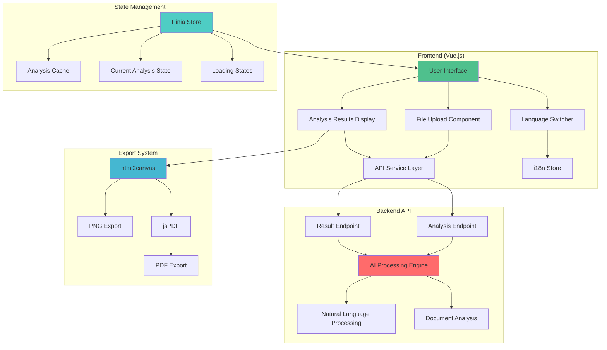
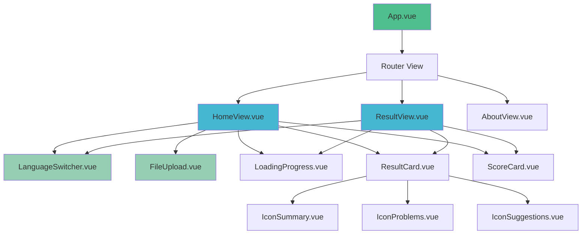
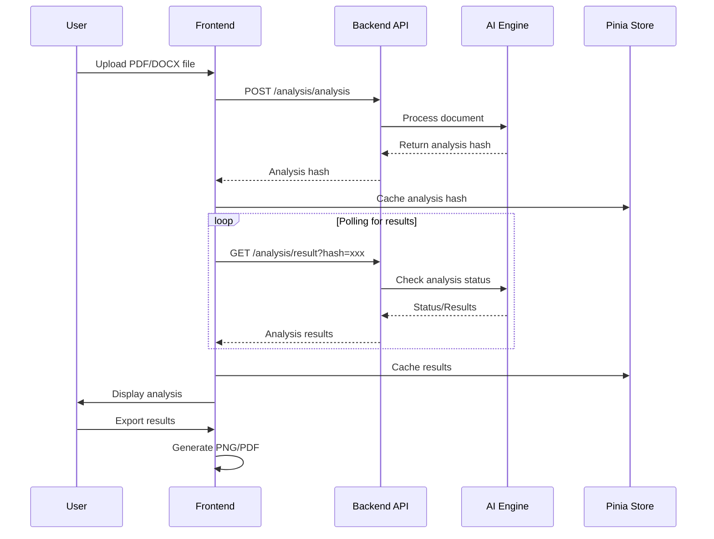

# PaperPoo Architecture

## System Architecture

```mermaid
graph TB
    subgraph "Frontend (Vue.js)"
        A[User Interface] --> B[File Upload Component]
        A --> C[Analysis Results Display]
        A --> D[Language Switcher]
        B --> E[API Service Layer]
        C --> E
        D --> F[i18n Store]
    end
    
    subgraph "State Management"
        G[Pinia Store] --> H[Analysis Cache]
        G --> I[Current Analysis State]
        G --> J[Loading States]
    end
    
    subgraph "Backend API"
        K[Analysis Endpoint] --> L[AI Processing Engine]
        M[Result Endpoint] --> L
        L --> N[Natural Language Processing]
        L --> O[Document Analysis]
    end
    
    subgraph "Export System"
        P[html2canvas] --> Q[PNG Export]
        P --> R[jsPDF] --> S[PDF Export]
    end
    
    E --> K
    E --> M
    C --> P
    G --> A
    
    style A fill:#4FC08D
    style L fill:#FF6B6B
    style G fill:#4ECDC4
    style P fill:#45B7D1
```

## Component Structure

```mermaid
graph TD
    A[App.vue] --> B[Router View]
    B --> C[HomeView.vue]
    B --> D[ResultView.vue]
    B --> E[AboutView.vue]
    
    C --> F[LanguageSwitcher.vue]
    C --> G[FileUpload.vue]
    C --> H[LoadingProgress.vue]
    C --> I[ResultCard.vue]
    C --> J[ScoreCard.vue]
    
    D --> F
    D --> H
    D --> I
    D --> J
    
    I --> K[IconSummary.vue]
    I --> L[IconProblems.vue]
    I --> M[IconSuggestions.vue]
    
    style A fill:#4FC08D
    style C fill:#45B7D1
    style D fill:#45B7D1
    style F fill:#96CEB4
    style G fill:#96CEB4
```

## Data Flow

```mermaid
sequenceDiagram
    participant U as User
    participant UI as Frontend
    participant API as Backend API
    participant AI as AI Engine
    participant Store as Pinia Store
    
    U->>UI: Upload PDF/DOCX file
    UI->>API: POST /analysis/analysis
    API->>AI: Process document
    AI-->>API: Return analysis hash
    API-->>UI: Analysis hash
    UI->>Store: Cache analysis hash
    
    loop Polling for results
        UI->>API: GET /analysis/result?hash=xxx
        API->>AI: Check analysis status
        AI-->>API: Status/Results
        API-->>UI: Analysis results
    end
    
    UI->>Store: Cache results
    UI->>U: Display analysis
    U->>UI: Export results
    UI->>UI: Generate PNG/PDF
```
